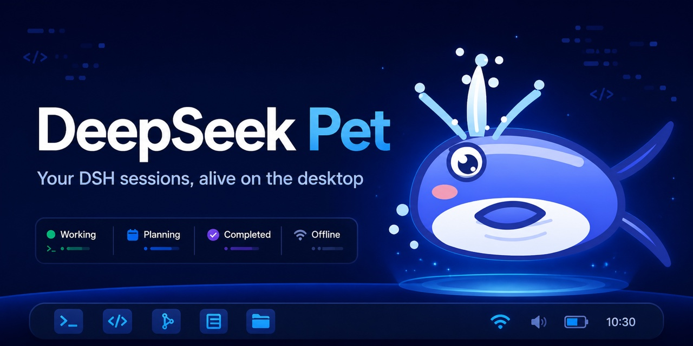

# DeepSeek Pet

[English](README.md) · 简体中文

[](https://github.com/zhaoryder/ds-pet/releases/latest)
[](https://github.com/zhaoryder/ds-pet/actions/workflows/build.yml)
[](LICENSE)

一只住在桌面角落的卡通鲸鱼，会实时跟随 DeepSeek Harness（DSH）会话改变动作和表情。

<p align="center">
  
</p>

<p align="center">
  
</p>

## 下载

从 [GitHub Releases](https://github.com/zhaoryder/ds-pet/releases/latest) 下载最新版安装包。

| 平台 | 安装包 |
| --- | --- |
| macOS Apple Silicon | `DeepSeek-Pet-0.1.2-mac-arm64.dmg` |
| macOS Intel | `DeepSeek-Pet-0.1.2-mac-x64.dmg` |
| Windows x64 | `DeepSeek-Pet-0.1.2-windows-x64.exe` |
| Linux x64 | `.AppImage` 或 `.deb` |

### macOS 安装方法

macOS 版本已经完成结构签名，但暂未经过 Apple 公证，因此第一次打开时可能被系统拦截。请按照下面的步骤操作：

1. 打开下载好的 `.dmg`，把 **DeepSeek Pet** 拖入 **Applications（应用程序）** 文件夹。
2. 进入“应用程序”，尝试打开一次 **DeepSeek Pet**。如果系统弹出拦截提示，先关闭提示框。
3. 点击屏幕左上角的 Apple 菜单，打开“系统设置”。
4. 在左侧选择“隐私与安全性”，然后向下滚动到“安全性”区域。
5. 找到“已阻止使用 DeepSeek Pet”之类的提示，点击“仍要打开”。
6. 使用 Touch ID 或 Mac 密码确认，然后在弹出的确认窗口中再次点击“仍要打开”。

以上操作通常只需要执行一次。如果系统提示“DeepSeek Pet 已损坏”，请先确认应用已经放入“应用程序”文件夹，然后打开“终端”并运行：

```bash
xattr -d com.apple.quarantine "/Applications/DeepSeek Pet.app"
```

运行完成后，再从“应用程序”中打开 **DeepSeek Pet**。

### Windows 使用 Microsoft Edge 安装

由于安装包暂时没有商业代码签名证书，Windows 和 Microsoft Edge 可能会拦截下载。如果 Edge 提示文件不安全：

1. 点击 Edge 右上角的下载图标，或者按 `Ctrl+J` 打开“下载”页面。
2. 找到被拦截的 **DeepSeek Pet** 安装包，点击“保留”。
3. 点击警告旁边的箭头或“显示详细信息”，然后选择“仍然保留”。
4. 打开下载好的 `.exe`。如果出现 Microsoft Defender SmartScreen 提示，点击“更多信息”，再点击“仍要运行”。

请只保留从本项目官方 [GitHub Releases](https://github.com/zhaoryder/ds-pet/releases/latest) 页面下载的文件。

## 功能

- 跟随 DSH 显示工作、思考、等待确认、完成、错误、睡眠和离线状态。
- 提供经典蓝鲸、软糖、夜航和像素四种风格。
- 支持音效、减少动效、开机启动、拖拽、点击互动、托盘菜单和鼠标穿透。
- 可以启动 `dsh web`；未安装 DSH 时，可通过 npm 安装 `@deepseek-ai/dsh`。
- 根据系统语言自动选择中文或英文界面。

## 运行要求

- Windows 10/11、macOS，或现代 x64 Linux 桌面系统
- 从应用内安装 DSH 时需要 [Node.js](https://nodejs.org/)
- 默认连接地址为 `http://127.0.0.1:3080`

## 从源码运行

```bash
npm install
npm start
```

可以通过 `DS_PET_URL` 或设置窗口修改 DSH 地址。

## 构建

```bash
npm run build:mac
npm run build:win
npm run build:linux
```

版本标签会触发 [GitHub Actions](.github/workflows/build.yml)，分别在 macOS、Windows 和 Ubuntu 上原生构建安装包。

## 许可证

[MIT](LICENSE) © 2026 zhaoryder。
